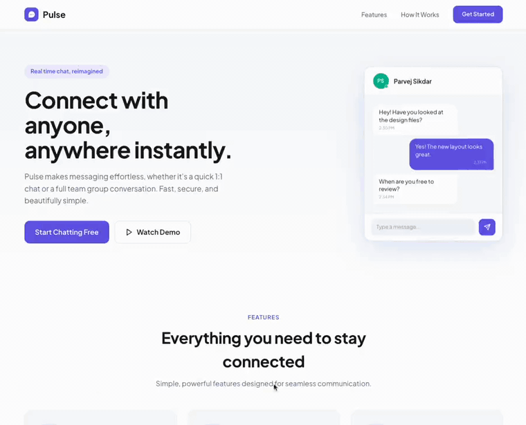

<a name="top"></a>

<div align="center">

# 💬 Relay

### A real time chat client for direct and group conversations

Relay is a chat application that starts with nothing more than a phone number. Search for
someone by name or number, message them one on one or in a group, and watch replies land the
moment they are sent, since every socket event writes straight into the app's data layer
instead of waiting on a refresh. History loads in smoothly as you scroll back, and the
interface keeps up with what is happening without ever getting in your way.

<p>
  
  
  
  
  
  
  
</p>

**[Live demo](https://relay-chatapp.netlify.app)** · **[Walkthrough](#preview)** · **[Getting started](#getting-started)**

</div>

---

<details>
<summary><strong>Table of contents</strong></summary>

- [Preview](#preview)
- [About the project](#about-the-project)
- [Key features](#key-features)
- [Built with](#built-with)
- [Architecture](#architecture)
- [Project structure](#project-structure)
- [Working with the provided API](#working-with-the-provided-api)
- [Engineering notes](#engineering-notes)
- [Getting started](#getting-started)
- [Project status and scope](#project-status-and-scope)
- [Roadmap](#roadmap)
- [Documentation](#documentation)
- [About the developer](#about-the-developer)
- [License](#license)

</details>

---

## Preview



▶️ **[Watch the full walkthrough (MP4)](https://github.com/parvej-brur/frontend-task-chatapp/raw/main/docs/media/preview.mp4)**

<p align="right"><a href="#top">Back to top</a></p>

---

## About the project

Relay is the frontend for a chat product. It consumes a provided REST and Socket.IO backend
and puts a full messaging interface in front of it: a conversation list, direct and group
threads, a group management panel, user search, and a phone number sign in that also handles
first time registration.

The work that matters here is at the client boundary. Real time updates are written straight
into the TanStack Query cache rather than refetched, server state and client state are kept
strictly apart, message history is de duplicated as it pages in, and a handful of places where
the live API disagrees with its own documentation are absorbed with normalizers and retry
policies instead of by changing what the interface asks for.

The project started as a frontend take home assessment for Taghyeer. It is kept here as a
portfolio piece that shows a feature folder architecture with an enforced dependency boundary,
a single HTTP path with one error type, and a considered split between what belongs in a
query cache and what belongs in a store. The live demo is hosted on Netlify at
[relay-chatapp.netlify.app](https://relay-chatapp.netlify.app) and mirrored on Vercel at
[frontend-task-chatapp-seven.vercel.app](https://frontend-task-chatapp-seven.vercel.app).

<p align="right"><a href="#top">Back to top</a></p>

---

## Key features

| Area                     | What it does                                                                                                                                                              |
| ------------------------ | ---------------------------------------------------------------------------------------------------------------------------------------------------------------------------- |
| **Real time messaging**  | New messages and conversation updates arrive over a WebSocket and are written into the query cache in place, so nothing waits on a refetch.                                 |
| **Direct and group chats** | One to one threads and multi participant groups share the same message list and composer.                                                                                |
| **Group management**     | Rename a group, add members, promote admins, and leave, all from a side panel.                                                                                             |
| **User search**          | Find people by display name or phone number and open a conversation from the result.                                                                                       |
| **Phone number sign in** | Enter a number and a display name. A number that has not been seen before is registered on the spot, so there is no separate sign up step.                                  |
| **Message history**      | Cursor paginated history that loads older pages on scroll, with day separators and clear sender styling. Rows repeated by the inclusive cursor are filtered on read.        |
| **Auto scroll**          | The view follows new messages while you sit at the bottom and holds still while you read older ones.                                                                        |
| **Session handling**     | The JWT lives in `localStorage`, mirrored through Redux. Any `401` clears the session once and the route gate redirects to login.                                           |

<p align="right"><a href="#top">Back to top</a></p>

---

## Built with

| Choice                                | Reason it is here                                                                                                                            |
| ------------------------------------- | ----------------------------------------------------------------------------------------------------------------------------------------------- |
| **Next.js 16, App Router**            | File based routing and route group layouts, used here for access gating rather than for server side data fetching.                             |
| **React 19 with TypeScript `strict`** | The type system is the main safety net in the project, so it is turned up fully.                                                               |
| **Tailwind CSS v4, CSS first config** | Design tokens live in `@theme` inside `globals.css`, so there is no `tailwind.config.js` to keep in sync. The landing page reuses those tokens. |
| **TanStack Query**                    | Server state, including cursor paginated history through `useInfiniteQuery` and socket driven cache writes through `setQueryData`.              |
| **Redux Toolkit**                     | Two small slices only: the session token and chat UI state, read by components that do not share a subtree.                                    |
| **socket.io-client**                  | The real time transport for new messages, conversation updates, and connection status.                                                        |
| **react-icons**                       | One icon set across the interface.                                                                                                            |

A data fetching layer written by hand and a second state library were both considered and left
out. Query covers the cache surgery the socket layer needs, and two reducers cover the rest.

<p align="right"><a href="#top">Back to top</a></p>

---

## Architecture

Requests flow through one client, land in one cache, and are read by feature components.
Sockets feed the same cache. Redux holds only what is not server data.

```
Provided backend (REST + Socket.IO)
        │
        ▼
src/lib/api/client.ts        attaches the bearer token, normalizes the error
        │                    shape, turns network failures into one ApiError type
        ▼
Feature api/ modules         query keys, request functions, response normalizers
        │
        ▼
TanStack Query cache   ◄────►   Socket handlers write new messages and
        │                       conversation updates into the cache in place
        ▼
Feature components            Redux Toolkit
  auth, chat, landing           sessionSlice: JWT and hydration flag
  route groups gate access      chatSlice: open conversation, unread counts, socket status
```

- **One HTTP path.** Every request goes through `apiRequest` in `src/lib/api/client.ts`. Paths
  live in `src/lib/api/endpoints.ts`, so components never build a URL or call `fetch`.
- **Server state and client state do not overlap.** Anything that comes from the API lives in
  TanStack Query. Only the token and a little chat UI state live in Redux. Nothing is copied
  between the two.
- **Sockets update the cache, not the screen directly.** `message:new` and
  `conversation:updated` write into the existing cache entry rather than trigger a refetch.
- **Auth failure is handled once.** A `401` anywhere is caught by the cache level error
  handlers in `QueryProvider`, which clear the session and let the route gate redirect.
- **The feature boundary is enforced.** `app` depends on `features`, `features` depend on
  shared code, and no feature imports another feature. ESLint checks this, it is not left to
  discipline.

<p align="right"><a href="#top">Back to top</a></p>

---

## Project structure

```
src/
  app/         Routing layer only. Routes and layouts, no business logic
  features/    Business domains: auth, chat, landing
               each owns api/ components/ hooks/ utils/ and one index.ts
  components/  Shared UI used by two or more features (ui/ layout/ shared/)
  providers/   Store, Query, and Session providers, mounted once in the root layout
  hooks/       Shared hooks (useSession, useDebouncedValue, useIsHydrated)
  store/       Redux store, slices, typed hooks
  lib/         Shared infrastructure (api/ auth/ utils/ constants/)
  config/      env.ts, site.ts
  styles/      globals.css, fonts.ts
  types/       Global types
public/          Static assets
tests/           Mirrors src/
docs/            API documentation and media
```

A feature exposes a single public surface through its `index.ts` and never imports another
feature. Shared code is promoted to `components/` or `lib/`. Every import resolves through the
one `@/*` alias rather than long relative paths.

<p align="right"><a href="#top">Back to top</a></p>

---

## Working with the provided API

These are real differences between the running API and its published spec. Each one is
absorbed at the client boundary with a normalizer or a retry policy, rather than worked
around by changing what the interface asks for.

- `GET /conversations` wraps its result in `{ data: [...] }`. Direct chats carry a singular
  `participant`, groups carry `participants` plus `admins`.
- `POST /conversations` returns only `{ _id, participants: string[] }`, so the direct chat
  flow refetches the list before selecting the new conversation.
- Message history comes back newest first and the `before` cursor is inclusive, so every page
  repeats its anchor message. Pages are reversed and their duplicates removed on read.
- The server accepts blank message text, so the composer blocks whitespace only sends and the
  list filters blank messages back out.
- Socket payloads use `id` and epoch millisecond `createdAt`, while REST uses `_id` and ISO
  strings. `normalizeMessage` converts socket payloads at the boundary.
- The socket connects at the host root, not under the `/api` base that REST uses.
- `GET /users/search` matches `name` as a case sensitive prefix and `phone` by exact
  equality, and it interpolates the term into a server side regex without escaping it. A term
  containing a plus sign, meaning any E.164 number, fails with `HTTP 500` before the phone
  comparison runs. The client stops retrying that failure and turns it into a message the
  user can act on.
- Error bodies are `{ error: { message, code } }`, not `{ message }`.

<p align="right"><a href="#top">Back to top</a></p>

---

## Engineering notes

A few decisions worth calling out for anyone reading the code:

- **App Router without a server session.** The backend is a bearer token API with no server
  session, so the JWT lives in `localStorage` and every screen is a client component. The App
  Router still earns its place through route group gating, where `(auth)` and `(protected)`
  layouts redirect once instead of every page guarding itself. The cost is an `AuthGate` that
  holds the gate closed until `useIsHydrated` confirms the client has caught up with storage.
- **TanStack Query over a fetch layer written by hand.** The deciding factor was the socket
  layer. `message:new` and `conversation:updated` need to write into an existing cache entry
  rather than trigger a refetch, and history is cursor paged with an inclusive cursor whose
  repeated rows need filtering. `useInfiniteQuery` with `setQueryData` covers both without
  reimplementing request de duplication and cache invalidation.
- **Redux Toolkit for exactly two slices.** `session` needs a listener middleware to mirror
  the token into `localStorage` without impure reducers. `chat` is read by components that do
  not share a subtree, such as the nav badge, the chat panel, and the socket hook. Keeping
  this in Redux makes the server state and client state split something ESLint can check.
- **Tailwind v4, CSS first.** Design tokens live in `@theme` inside `globals.css` instead of a
  separate config file, so there is one less place to keep in sync. The landing page reuses
  the same tokens as the app so the two read as one product.
- **A mocked chat preview on the landing page.** `ChatPreviewMock.tsx` reuses the real
  component's visual language but is a standalone static component. Wiring the authenticated
  chat panel through a fake session and fixture data was disproportionate for a first
  impression.

<p align="right"><a href="#top">Back to top</a></p>

---

## Getting started

**Prerequisites:** Node 18.18 or newer and npm.

```bash
git clone https://github.com/parvej-brur/frontend-task-chatapp.git
cd frontend-task-chatapp
npm install
cp .env.example .env.local   # optional, the defaults already point at the hosted API
npm run dev
```

Open [http://localhost:3000](http://localhost:3000). Sign in with any phone number and a
display name. A number that has not been seen before registers itself.

### Routes

| Route    | Screen                                                          |
| -------- | -------------------------------------------------------------- |
| `/`      | Public landing page with product copy and links into the app   |
| `/login` | Phone number and display name, a new number registers itself   |
| `/chat`  | Conversation list, chat panel, groups, real time updates       |

### Scripts

| Command             | Purpose                      |
| ------------------- | ---------------------------- |
| `npm run dev`       | Start the development server |
| `npm run build`     | Production build             |
| `npm run start`     | Serve the production build   |
| `npm run lint`      | Lint with ESLint             |
| `npm run lint:fix`  | Lint and auto fix            |
| `npm run typecheck` | Type check with `tsc`        |

### Environment

| Variable                   | Default                                          |
| -------------------------- | ---------------------------------------------- |
| `NEXT_PUBLIC_API_BASE_URL` | `https://frontend-task-chatapp.onrender.com/api` |
| `NEXT_PUBLIC_SOCKET_URL`   | `https://frontend-task-chatapp.onrender.com`   |

Every variable is read through `src/config/env.ts` rather than `process.env` directly, and
each one is listed in `.env.example`. No secrets are involved. Both URLs are public and the
JWT is obtained at runtime through login.

<p align="right"><a href="#top">Back to top</a></p>

---

## Project status and scope

This repo is the client only. The REST and Socket.IO backend is provided and hosted
separately. A few things are deliberately left simple:

- **No automated tests yet.** `tests/` mirrors `src/` by the folder convention but is empty.
  The message list, the pagination and duplicate filtering, and the socket cache writers are
  the first things to cover.
- **Sends are not optimistic.** A message either lands or shows an error. There is no local
  queue and retry.
- **No search within a conversation and no read receipts.** You know a message sent, not
  whether it was delivered or seen.

<p align="right"><a href="#top">Back to top</a></p>

---

## Roadmap

- Add a Vitest and React Testing Library suite, starting with the message list and the
  `useMessages` pagination and de dupe logic.
- Make sends optimistic, with a visible failed state and tap to retry.
- Add search within a conversation.
- Add delivered and seen receipts.

<p align="right"><a href="#top">Back to top</a></p>

---

## Documentation

| Document | What it covers |
| :--- | :--- |
| [`docs/API_Documentation.md`](docs/API_Documentation.md) | The API reference, written before any feature code: REST endpoints, request and response shapes, the error format, and the Socket.IO event contract. |

<p align="right"><a href="#top">Back to top</a></p>

---

## About the developer

Built by **Parvej Sikdar**.

- Portfolio: [agriyo.netlify.app](https://agriyo.netlify.app)
- GitHub: [@parvej-brur](https://github.com/parvej-brur)

I designed the architecture and the system flows. I used Claude to generate boilerplate,
scaffold feature folders, and move faster through repetitive work such as API integration,
state wiring, and this documentation. I reviewed and controlled the implementation, handled
the API edge cases, kept comments minimal, and managed Git history by hand.

<p align="right"><a href="#top">Back to top</a></p>

---

## License

This project is a portfolio piece. The code is available for reading and reference. Please ask
before reusing a substantial part of it in another project.

<p align="right"><a href="#top">Back to top</a></p>
